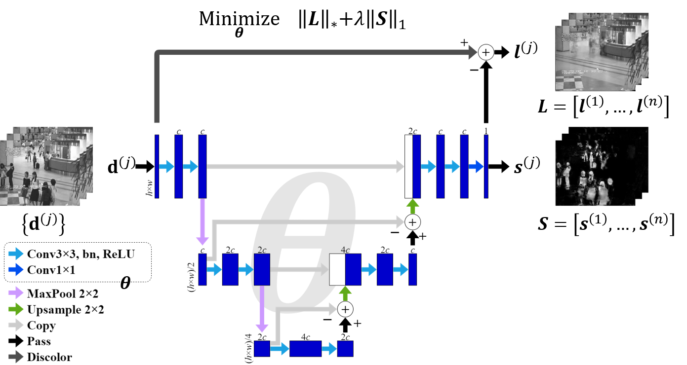

# DeepLS
This repository proposes unsupervised deep learning exploiting low-rank and sparse priors of dataset.
Robust principal component analysis (RPCA) can achieve background subtraction by minimizing nuclear and $\ell_1$ norms to exploit the prior knowledge about spatio-temporal sparseness and low-rankness of the foreground objects and background scene.
With a combination of these norms as a loss function, the proposed method trains a U-Net-based model so as to encode and decode the sparse foreground objects for a batch of input images with a low-rank background.
Once the model has learned enough features common to the foreground objects, it has the potential to detect them from any single image regardless of the low-rankness and sparseness.
The proposed model performs online object segmentation with much less computational expense than that of RPCA.
The present method can build up a well-generalized model from only a few dozen of unannotated training images.

## Paper

## Citation

## Acknowledgements
