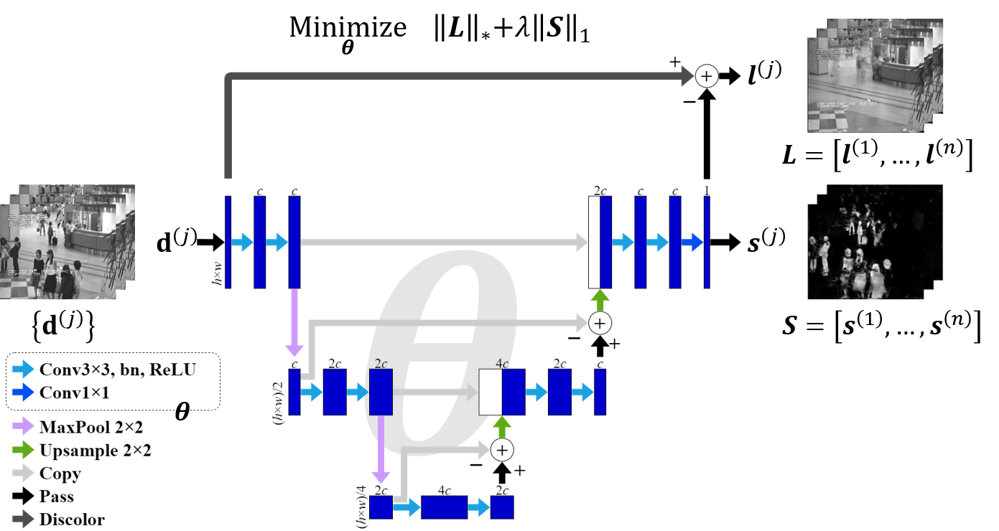

## DeepLS

*DeepLS* is a novel unsupervised deep learning approach designed for online separation of sparse signal components. This method leverages the low-rank and sparse priors inherent in datasets for training purposes. It utilizes a U-Net-based model, structured similarly to an hourglass, which efficiently encodes and decodes sparse components. During training, the model employs a loss function based on a combination of nuclear and $\ell_1$ norms, mirroring the objective function of Robust Principal Component Analysis (RPCA). This approach encourages the model to discern and isolate the sparse components within the input data. 

Notably, once trained, the DeepLS model gains the capacity to extract learned sparse components from a diverse range of inputs, not limited to those exhibiting low-rank characteristics. This capability eliminates the need for retraining the model for varying backgrounds, leading to computationally efficient online separation of target signals that share features with the learned sparse components from the training dataset.




## Applications
[demo programs](./demo)


*   **Learning foreground objects from surveillance video**: DeepLS can effectively learn and separate foreground objects from the background in video surveillance tasks, even with changes in viewpoints or background conditions. Once trained on a set of images, the DeepLS model can detect the learned foreground objects in new images without retraining. This is a significant advantage over traditional methods like RPCA, which require recomputation for each new image.

    - [**DEMO**](./demo/demo_background_subtraction.ipynb): Background subtraction on Airport dataset [Li+04] including comparison to RPCA [Candes+09].
    - [Takeda, K., & Sakai, T., "Unsupervised deep learning of foreground objects from low-rank and sparse dataset,"  Computer Vision and Image Understanding, 240, 103939, January 2024.](https://doi.org/10.1016/j.cviu.2024.103939)   This article discusses DeepLS's application in various domains, including background subtraction in video surveillance and cell segmentation in microscopy images.
    - [Takeda, K., Fujiwara, K., & Sakai, T., "Unsupervised deep learning for online foreground segmentation exploiting low-rank and sparse priors," International Conference on Digital Image Computing: Techniques and Applications (DICTA) Proceedings, pp. 1-7, November 2022.](https://doi.org/10.1109/DICTA56598.2022.10034581)  This paper presents a method for unsupervised deep learning for online foreground segmentation using a U-Net-based model that leverages the low-rank and sparse nature of foreground objects and backgrounds. 


*   **Background bias removal from cytology images:** DeepLS can mitigate the impact of spurious features, such as those arising from slide deterioration, in cytological image analysis. By effectively removing background information, DeepLS allows for more accurate cell classification based on cellular features rather than background artifacts. For example, DeepLS successfully removed background from Pap-stained oral cytology images, improving the accuracy of classifying normal and abnormal cells.

    - [**DEMO**](./demo/demo_cell_segmentation.ipynb): Cell segmentation on [ISBI 2014 dataset](https://cs.adelaide.edu.au/~carneiro/isbi14_challenge/) incorporating [anisotropic total variation](https://en.wikipedia.org/wiki/Total_variation_denoising) in the loss function.
    - [Takeda, K., Sakai, T., & Mitate, E., "Background removal for debiasing computer-aided cytological diagnosis," International Journal of Computer Assisted Radiology and Surgery, June 2024.](https://doi.org/10.1007/s11548-024-03169-0)  This article focuses on the problem of background bias in computer-aided cytology and presents DeepLS as a solution. The authors demonstrate the method's effectiveness in debiasing by showing its success in removing background from oral cytology images.
    - [Takeda, K., Mitate, E., & Sakai, T., "Background subtraction approach to unsupervised cell segmentation: Toward excluding spurious features in degraded cytology slides," IEEE 20th International Symposium on Biomedical Imaging (ISBI) Proceedings, pp. 1-5, April 2023.](https://doi.org/10.1109/ISBI53787.2023.10230323)  This paper discusses the application of DeepLS for cell segmentation, particularly in addressing the issue of spurious features in degraded cytology slides.


*   **Signal separation of anomalous sounds from spectrograms:** While the provided sources don't directly apply the DeepLS framework to audio data, the same underlying principle of low-rank and sparse decomposition is applicable for signal separation. This suggests the potential of DeepLS for extracting anomalous sounds, such as wheezes or rhonchi, from spectrograms. These sounds often exhibit sparsity compared to the more redundant breath sounds, making them suitable targets for DeepLS-based separation.
    - [Onomichi, T., Sakai, T., & Obase, Y., "Unsupervised deep learning of sparse signals against low-rank backgrounds with application to online lung sound separation," International Journal of Signal Processing Systems, vol. 11, no. 1, March 2023.](https://doi.org/10.18178/ijsps.11.1.1-6)  This paper details a method for separating sparse signals from mixtures with low-rank backgrounds. The authors highlight its application in online lung sound separation.


<!--

## available codes
[demo programs](./demo)
- [Application to background subtraction](./demo/demo_background_subtraction.ipynb)
  - Airport dataset [Li+04]
  - including comparison to RPCA [Candes+09]
- [Application to cell segmentation](./demo/demo_cell_segmentation.ipynb)
  - [ISBI 2014 dataset](https://cs.adelaide.edu.au/~carneiro/isbi14_challenge/)
  - including introduction of [anisotropic total variation](https://en.wikipedia.org/wiki/Total_variation_denoising) for loss function

## Paper
"Unsupervised deep learning for online foreground segmentation exploiting low-rank and sparse priors"
2022 International Conference on Digital Image Computing: Techniques and Applications (DICTA)
https://ieeexplore.ieee.org/document/10034581

Incoming!:
Background subtraction approach to unsupervised cell segmentation toward excluding spurious featues in degraded cytology slides
2023 IEEE 20th International Symposium on Biomedical Imaging (ISBI)

## Citation
Low-rank and sparse loss:
```bib
@INPROCEEDINGS{takeda22,
  author={Takeda, Keita and Fujiwara, Kohei and Sakai, Tomoya},
  booktitle={2022 International Conference on Digital Image Computing: Techniques and Applications (DICTA)}, 
  title={Unsupervised deep learning for online foreground segmentation exploiting low-rank and sparse priors}, 
  year={2022},
  pages={1-7},
  doi={10.1109/DICTA56598.2022.10034581}}
```

-->
